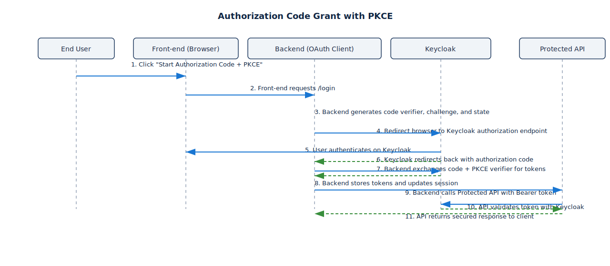

# OAuth Study Environment

Local playground for experimenting with OAuth 2.0 and OpenID Connect using [Keycloak](https://www.keycloak.org/) running in Docker.


## Prerequisites
- Docker Engine 24+
- Docker Compose plugin (bundled with recent Docker Desktop releases)
- `curl` and [`jq`](https://stedolan.github.io/jq/) for the helper scripts

## Getting Started
1. Boot the stack:
   ```bash
   make up
   ```
   Wait until you see `Keycloak 24.0` and `Listening on: http://0.0.0.0:8080`.

2. Open http://localhost:8080 in your browser and sign in to the admin console with:
   - Username: `admin`
   - Password: `admin`

The realm `oauth-study` is auto-imported with example clients, roles, and a demo user.


### Makefile Shortcuts
- `make up` — start the stack
- `make logs` — tail Keycloak logs
- `make token` — request a client credentials token
- `make app-install` — install the sample app dependencies
- `make app-run` — run the sample app on port 3000
- `make api-install` — install the protected API dependencies
- `make api-run` — run the protected API on port 4000
- `make down` — stop containers
- `make clean` — stop containers and remove volumes

## Sample Realm Contents

### General Data
| Item | Details |
| --- | --- |
| Realm | `oauth-study` |
| Demo user | - Username: `demo`<br>- Password: `demo` |
| Clients | - `public-pkce-client` (public, Auth Code + PKCE)<br>- Redirects: `http://localhost:3000/*`, `http://localhost:8000/callback`<br>- `confidential-cli` (confidential, Client Credentials)<br>- Secret: `confidential-cli-secret` |
| Realm roles | - `service.reader`<br>- `service.writer` |


### Client's Data
| Property | `public-pkce-client` | `confidential-cli` |
| --- | --- | --- |
| Client type | - Public OAuth client<br>- SPA/native-style flow<br>- Authorization Code + PKCE | - Confidential OAuth client<br>- CLI/service-to-service<br>- Client Credentials grant |
| Key grant types | - `standardFlowEnabled: true`<br>- PKCE S256 enforced via `pkce.code.challenge.method` | - `serviceAccountsEnabled: true`<br>- Auth code, implicit, password grants all disabled |
| Credentials | - No client secret<br>- Relies on PKCE + redirect URIs | - Requires `confidential-cli-secret`<br>- Authenticate with Basic/POST body |
| Redirect URIs & web origins | - `http://127.0.0.1:3000/*`<br>- `http://localhost:3000/*`<br>- `http://127.0.0.1:8000/callback`<br>- `http://localhost:8000/callback`<br>- Web origins scoped to port 3000 | - Not browser-based<br>- No redirect URIs needed |
| Scope behaviour | - Default scopes: `profile`, `email`, `roles`, `web-origins`<br>- Optional: `address`, `phone`<br>- `fullScopeAllowed: true` | - Default scopes mirror public client<br>- Optional scopes identical<br>- `fullScopeAllowed: false` to demand explicit assignment |
| Protocol mappers | - Uses Keycloak defaults<br>- Claims driven by scopes | - Adds realm-role mapper<br>- Ensures `roles` claim in tokens |

## Try OAuth Flows

### Authorization Code + PKCE (Public Client)

<p align="center">
  
</p>
<p align="center"><em>PKCE (Proof Key for Code Exchange) lets public clients prove they are the ones that initiated the login by pairing the authorization code with a one-time code verifier. The client sends a hash (code challenge) during the redirect, then redeems the code with the original verifier so intercepted codes can’t be abused.</em></p>

1. Sign in to the Keycloak admin console and select the `oauth-study` realm.
2. Copy the client ID `public-pkce-client`.
3. Use an OAuth debugger (e.g. https://oidcdebugger.com) or your own local client to initiate the Authorization Code flow.
   - Authorization endpoint: `http://localhost:8080/realms/oauth-study/protocol/openid-connect/auth`
   - Token endpoint: `http://localhost:8080/realms/oauth-study/protocol/openid-connect/token`
   - Redirect URI: `http://localhost:8000/callback` (must match exactly)
   - PKCE method: `S256`
4. When prompted, sign in with user `demo` / `demo`.
5. Inspect the returned ID/access tokens in the debugger to understand claims, scopes, and expiry.
6. Copy the access token and call the protected API:
   ```bash
   curl -H "Authorization: Bearer <ACCESS_TOKEN>" http://localhost:4000/api/hello
   ```

### Client Credentials (Confidential Client)
<p align="center">
  
</p>

Use the helper script to request a token using the `confidential-cli` client:
```bash
make token
```
The script POSTs to the token endpoint and pretty-prints the JSON response. You can supply a different client ID/secret and override the realm or Keycloak URL via environment variables:

### Password Grant (Optional)
Direct Access Grants are disabled by default for security. You can enable them on a client by editing the client configuration in the admin console.

## Protected API (Port 4000)
The `api/` directory exposes an Express API that validates Bearer tokens issued by Keycloak.

1. Install dependencies and copy the environment template:
   ```bash
   make api-install
   cp api/.env.example api/.env
   # edit api/.env as needed (e.g., REQUIRED_ROLE)
   ```
2. Start the API:
   ```bash
   make api-run
   ```
   The server listens on http://localhost:4000 and exposes:
   - `GET /healthz` — unauthenticated health check
   - `GET /api/hello` — requires a valid access token and (by default) the `service.reader` role
3. Hit the protected route with a token obtained via the Authorization Code flow:
   ```bash
   TOKEN=<paste_access_token>
   curl -s -H "Authorization: Bearer ${TOKEN}" http://localhost:4000/api/hello | jq
   ```
   The response echoes the subject, roles, and token timestamps, proving the request passed validation.

> ℹ️ The `demo` user has the `service.reader` realm role pre-assigned. If you prefer to call the API with the `confidential-cli` service account instead, grant that role to the client’s service account in Keycloak or relax `REQUIRED_ROLE` in `api/.env`.
